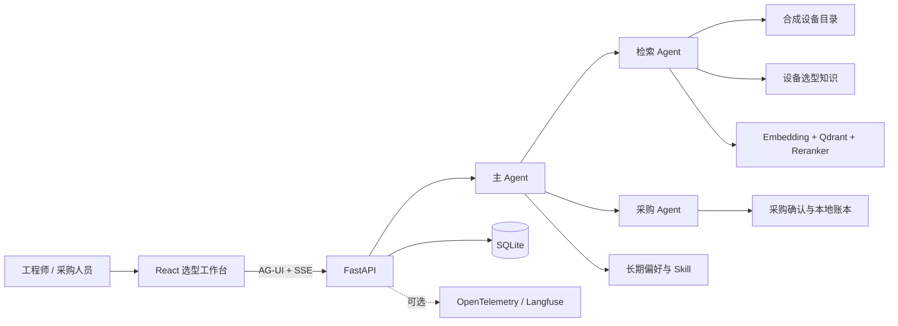

# EquipForge

**多智能体协同的智能装备选型与决策平台**

EquipForge 面向工业视觉、自动化控制与智能制造场景。用户只需描述工况、预算、接口和性能要求，系统即可检索候选设备、核对关键参数、生成比较结论，并在网页中展示可追溯的选型建议。

项目内置 500 个设备型号、705 个规格配置以及六类选型知识，可在克隆代码并配置模型凭据后直接运行。

## 适用场景

- 为流水线缺陷检测选择工业相机、镜头和光源
- 按量程、精度、输出方式和防护等级筛选工业传感器
- 按协议、I/O 数量和算力选择边缘控制器
- 比较运动控制与通信采集设备
- 保存团队偏好，在后续会话中复用接口、品牌和预算要求
- 将候选设备加入备选清单并生成采购意向

## 核心能力

- **多智能体协同**：主 Agent 负责理解需求与组织结果，专业 Agent 按需完成设备检索和采购任务。
- **设备检索与精排**：Embedding、Qdrant 与可选 Reranker 组成检索链路；精排不可用时自动降级。
- **参数约束**：预算、设备类别、供货地区和精确设备编号由代码过滤，避免只依赖模型判断。
- **结构化结果**：实时返回设备卡、规格详情、候选比较和采购确认，不从模型文本猜测参数或库存。
- **长期偏好与 Skill**：保存接口、精度、品牌等偏好，也可以编写团队自己的选型流程。
- **会话恢复**：刷新或短暂断网后可恢复对话、设备卡和运行进度。
- **安全确认**：采购意向必须由用户明确确认后才写入本地业务账本。
- **可选可观测性**：支持通过 OpenTelemetry 接入 Langfuse。

## 快速开始

### 1. 克隆项目

```bash
git clone https://github.com/Chean-z/EquipForge.git
cd EquipForge
```

### 2. 配置模型

复制环境变量模板。已有 `.env` 时不要覆盖。

macOS / Linux：

```bash
test -f .env || cp .env.example .env
```

Windows PowerShell：

```powershell
if (-not (Test-Path .env)) { Copy-Item .env.example .env }
```

打开 `.env`，至少配置以下字段：

```dotenv
LLM_BASE_URL=https://dashscope.aliyuncs.com/compatible-mode/v1
LLM_API_KEY=填写你的模型服务密钥
LLM_MODEL=qwen3-max
EMBEDDING_MODEL=text-embedding-v4
```

默认配置适用于阿里云百炼 OpenAI 兼容接口。也可以换成其他兼容 OpenAI Chat Completions、流式输出、工具调用和 Embeddings 的服务。

如果 Chat 与 Embedding 使用不同服务，再配置：

```dotenv
EMBEDDING_BASE_URL=https://你的-embedding-服务/v1
EMBEDDING_API_KEY=填写你的-embedding-密钥
EMBEDDING_MODEL=填写可用模型名
```

`.env` 已被 Git 忽略。不要把真实密钥写入 `.env.example` 或提交到仓库。

### 3. 启动应用

推荐使用 Docker Compose：

```bash
docker compose --env-file .env -f docker/docker-compose.yaml up -d --build
```

等待服务启动后访问：

- 应用页面：[http://127.0.0.1:5173](http://127.0.0.1:5173)
- 健康检查：[http://127.0.0.1:8000/health](http://127.0.0.1:8000/health)
- API 文档：[http://127.0.0.1:8000/docs](http://127.0.0.1:8000/docs)

查看运行状态：

```bash
docker compose --env-file .env -f docker/docker-compose.yaml ps
docker compose --env-file .env -f docker/docker-compose.yaml logs --tail 100 app worker
```

停止应用并保留数据：

```bash
docker compose --env-file .env -f docker/docker-compose.yaml down
```

不要添加 `-v`，否则 Docker 命名卷中的运行数据会被删除。

## 本机运行

适合需要修改代码或调试前后端的用户。

### 环境要求

- Python 3.11–3.13
- [uv](https://docs.astral.sh/uv/)
- Node.js 22
- npm

安装依赖：

```bash
uv sync --frozen
npm --prefix frontend ci
```

终端一启动后端：

```bash
uv run python -m uvicorn app.presentation.server:app --host 127.0.0.1 --port 8000 --workers 1
```

终端二启动前端：

```bash
npm --prefix frontend run dev -- --host 127.0.0.1 --port 5173 --strictPort
```

默认本机模式使用 SQLite 和嵌入式 Qdrant，不要求额外安装 MySQL、Redis 或独立向量数据库。首次启动会初始化设备索引，因此可能需要等待一段时间，并产生 Embedding 调用费用。

## 开始一次设备选型

打开应用页面后，可以直接输入：

```text
预算 5000 元，为流水线外观缺陷检测选择一款全局快门工业相机。
```

也可以尝试：

```text
选择支持 Modbus TCP、至少 8 路数字量输入的边缘控制器。
```

```text
比较适合机械臂定位的三款视觉设备，优先考虑精度和响应速度。
```

一次完整选型会依次呈现实时执行进度、文字建议、候选设备卡、关键参数和比较结果。需要保留候选时可加入备选清单；生成采购意向时，系统会再次要求确认。

## 数据说明

仓库提供可复现的合成演示数据，不依赖外部设备数据集：

| 数据 | 规模 |
| --- | ---: |
| 设备型号 | 500 SPU |
| 规格配置 | 705 SKU |
| 设备类别 | 6 类 |
| 选型知识 | 42 篇 / 210 个检索分块 |

覆盖类别：工业相机、镜头光源、工业传感器、边缘控制器、运动控制、通信采集。

所有厂商、型号、参数、价格和库存均为合成内容，仅用于功能演示与二次开发，不代表真实厂商规格、实时报价或采购建议。

## 常用配置

完整模板见 [.env.example](.env.example)。

| 配置项 | 是否必需 | 说明 |
| --- | --- | --- |
| `LLM_BASE_URL` | 是 | OpenAI 兼容服务的 `/v1` 地址 |
| `LLM_API_KEY` | 是 | 模型服务密钥 |
| `LLM_MODEL` | 是 | 支持流式输出和工具调用的模型 |
| `EMBEDDING_MODEL` | 是 | 向量模型；默认复用 LLM 服务地址和密钥 |
| `EMBEDDING_BASE_URL` | 否 | Embedding 使用独立服务时配置 |
| `EMBEDDING_API_KEY` | 否 | Embedding 独立密钥 |
| `RERANKER_BASE_URL` | 否 | HTTP Reranker 服务地址；为空时自动降级 |
| `RERANKER_MODEL` | 否 | Reranker 模型名称 |
| `QDRANT_URL` | 否 | 为空时使用本地嵌入式 Qdrant |
| `REDIS_URL` | 否 | 缓存和异步任务；网页选型主流程不强制依赖 |
| `LANGFUSE_BASE_URL` | 否 | Langfuse 服务地址 |
| `LANGFUSE_PUBLIC_KEY` | 否 | Langfuse 公钥 |
| `LANGFUSE_SECRET_KEY` | 否 | Langfuse 私钥 |

Reranker 使用示例：

```dotenv
RERANKER_BASE_URL=https://你的-reranker-服务
RERANKER_MODEL=qwen3-reranker-8b
```

## 数据持久化

- 本机模式默认将会话、偏好、Skill、选型记录和向量索引保存到 `data/`。
- Docker Compose 使用 `app-data`、`qdrant-data` 和 `redis-data` 命名卷。
- 普通刷新不会删除服务端记录。
- 更换浏览器、域名或端口会产生不同的本地演示身份。
- 备份前建议停止写入进程，并完整备份数据目录或 Docker 命名卷。

## 系统架构



主要技术栈：AgentScope 2.x、FastAPI、AG-UI、React、TypeScript、Qdrant、SQLite、Redis、OpenTelemetry、Langfuse。

## 项目结构

```text
app/application/       Agent、工具与应用用例
app/domain/            设备、会话和采购领域模型
app/infrastructure/    模型、检索、存储、缓存与可观测适配
app/presentation/      FastAPI 与 AG-UI 接口
data/catalog-v1.jsonl  版本化合成设备目录
frontend/              React 选型工作台
knowledge/             六类设备选型知识
scripts/               数据生成、评测与版本管理脚本
tests/                 后端自动化测试
docker/                Docker Compose 部署配置
```

## 验证与排错

健康检查：

```bash
curl --fail http://127.0.0.1:8000/health
```

自动化测试：

```bash
uv run python -m pytest -q
npm --prefix frontend test
npm --prefix frontend run build
```

常见问题：

| 现象 | 处理方式 |
| --- | --- |
| 启动提示缺少 `LLM_API_KEY` | 检查根目录 `.env`，不要使用模板中的占位值 |
| 模型返回 401/403 | 检查密钥、服务地址以及账户是否有目标模型权限 |
| 健康检查正常但没有选型结果 | 检查 Chat、Embedding 和 Reranker 请求日志；`/health` 不会执行真实模型调用 |
| Qdrant 目录被锁 | 关闭重复后端进程；多进程部署应配置独立 Qdrant 服务 |
| 修改前端后仍显示旧页面 | 重新执行前端构建并刷新浏览器缓存 |
| 刷新后看不到原会话 | 确认访问时使用了相同协议、主机名和端口，并检查数据目录是否变化 |

## 使用边界

EquipForge 当前提供的是可运行的选型应用底座和合成演示数据。接入生产环境前，应替换为经过授权的真实设备目录与技术资料，并增加企业身份认证、供应商询价、合同审批及真实库存系统集成。
